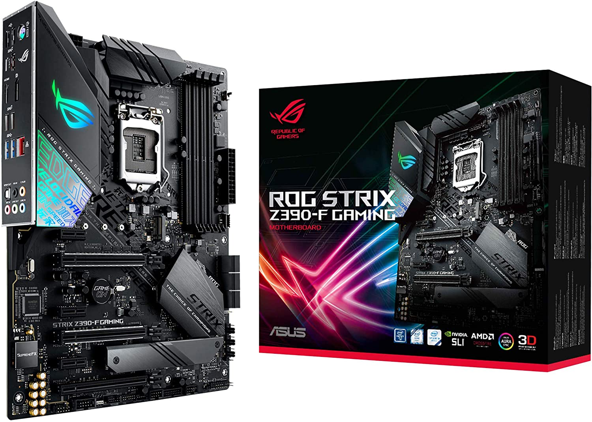
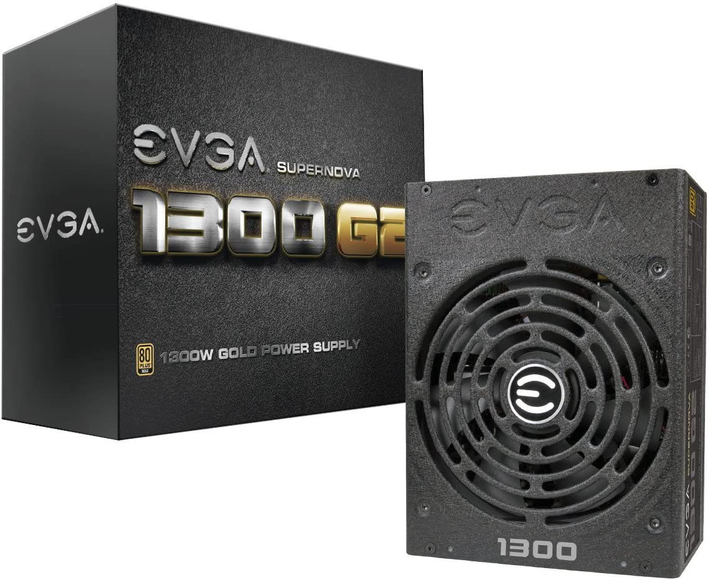
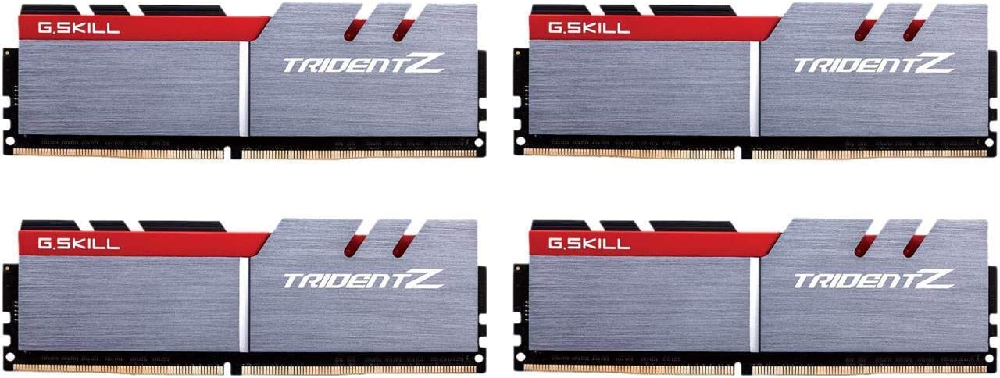
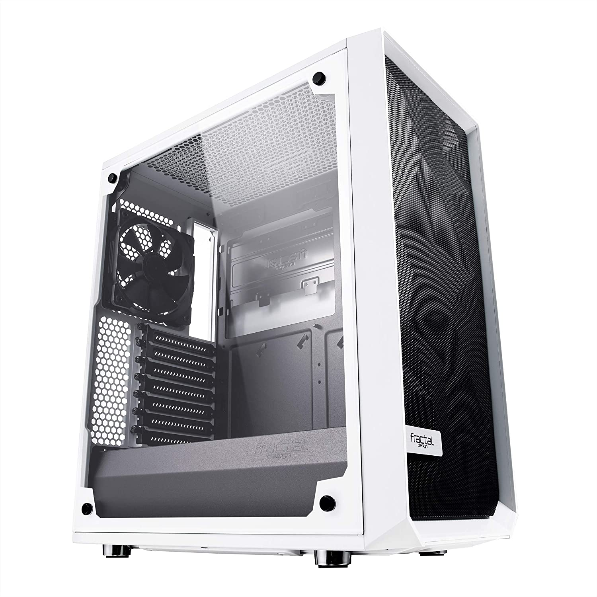

# ISM4154_Project-

We will be working on the ISM4154 project within this folder.

## Business Pool

  Typical online store like Amazon.com 

  ### First needs

  Create an about us page, business logo, page listing products (5-10), customer registration page, customer checkout page. 

  ### TODOs
    -Creating the folder
    -Adding files
    -Connecting files

    
#### KEEP FOR LATER

    

      
      <h1>Intel Core i9-10900KF Desktop Processor</h1>
      
$648.99

      
Coffee Lake 8-Core, 16-Thread, 3.6 GHz (5.0 GHz Turbo) LGA 1151 (300 Series) 95W BX806849900K Desktop Processor Intel UHD Graphics 630

      
<button>Add to Cart</button>

    

    

      
      <h1>ASUS ROG STRIX Z490-F Motherboard</h1>
      
$259.99

      
GAMING LGA 1200 Intel Z490 SATA 6Gb/s ATX Intel Motherboard

      
<button>Add to Cart</button>

    

    

      
      <h1> EVGA SuperNOVA 1300 Powersupply</h1>
      
$289.99

      
80+ GOLD 1300W Fully Modular Includes FREE Power On Self Tester Power Supply

      
<button>Add to Cart</button>

    

    

      
      <h1>G.SKILL TridentZ RAM</h1>
      
$509.99

      
64GB (8 x 8GB) 288-Pin DDR4 SDRAM DDR4 3200 (PC4 25600) Intel X99 Platform Desktop Memory Model F4-3200C14Q2-64GTZSW

      
<button>Add to Cart</button>

    

    

      
      <h1> Fractal Design Meshify C White Case</h1>
      
$89.99

      
Tempered Glass ATX Mid Tower High-Airflow Compact Clear Tempered Glass Computer Case

      
<button>Add to Cart</button>

    

  

  